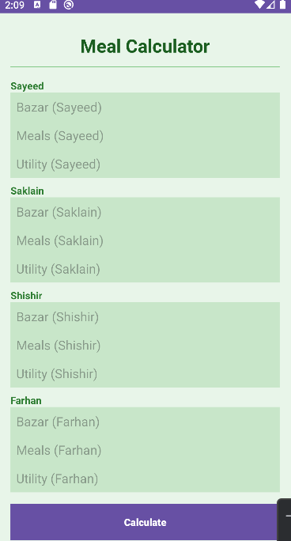
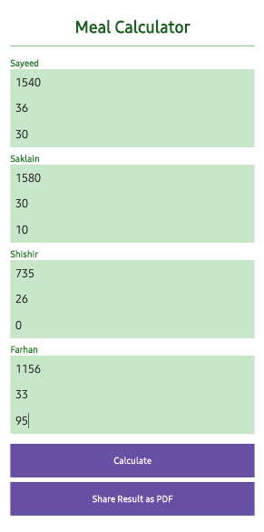
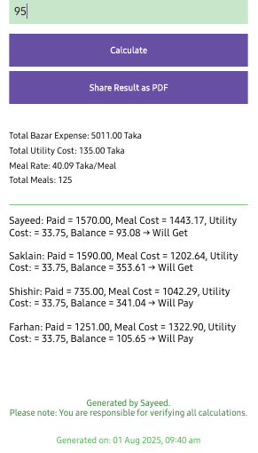

# 🍴 Meal Calculator – Smart Expense & Utility Manager for Roommates

---

## 📖 Description
Meal Calculator is an **Android app** designed to simplify **shared meal and utility expense management** for students, bachelors, and roommates.  

With this app, you can:  
- Calculate **meal rates (cost per meal)** automatically  
- Track **bazar expenses** and **utility bills** for each member  
- Split costs fairly among all members  
- See **who will pay or get money back** instantly  
- Export and **share results as PDF** with one click  

Whether you live in a **hostel, shared apartment, or bachelor mess**, this app makes **meal cost management easy, transparent, and hassle-free.**

---

## 🚀 Features
- ✅ Add **bazar expenses**, **utility costs**, and **meals count** per member  
- ✅ Auto-calculate **meal rate** and **total expenses**  
- ✅ Fairly split utility cost among members  
- ✅ Get a clear **balance sheet** (who will pay or get money)  
- ✅ **Export to PDF** and share with others  
- ✅ Simple, lightweight, and user-friendly interface  

---

## 📱 Screenshots   

